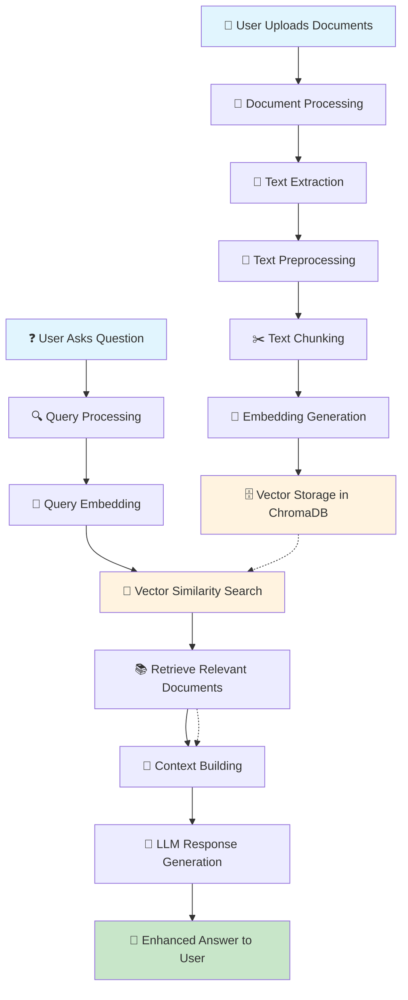

# 🔄 RAG Workflow Diagram

## 📋 Complete RAG Process Flow



## 🔧 Detailed Component Flow

### **Phase 1: Document Indexing**
```
┌─────────────────────────────────────────────────────────────┐
│                    📄 Document Indexing                     │
├─────────────────────────────────────────────────────────────┤
│ 1. 📁 Load Documents (PDF, TXT, DOCX, MD, HTML)            │
│ 2. 📝 Extract Text Content                                 │
│ 3. 🧹 Preprocess Text (clean, normalize)                   │
│ 4. ✂️  Chunk into Segments (1000 chars, 200 overlap)       │
│ 5. 🧠 Generate Embeddings (384-dim vectors)                │
│ 6. 🗄️  Store in ChromaDB with Metadata                    │
└─────────────────────────────────────────────────────────────┘
```

### **Phase 2: Query Processing**
```
┌─────────────────────────────────────────────────────────────┐
│                    ❓ Query Processing                      │
├─────────────────────────────────────────────────────────────┤
│ 1. 🧠 Convert Query to Embedding                          │
│ 2. 🔍 Search Vector Database (Cosine Similarity)          │
│ 3. 📚 Retrieve Top-K Relevant Documents                   │
│ 4. 🔗 Build Context from Retrieved Documents              │
│ 5. 🤖 Inject Context into LLM Prompt                      │
│ 6. 💬 Generate Enhanced Response                          │
└─────────────────────────────────────────────────────────────┘
```

## 🎯 Key Data Transformations

### **Text → Vector Transformation**
```
Input Text: "Machine learning algorithms can be supervised or unsupervised"
     ↓
Preprocessing: "machine learning algorithms can be supervised or unsupervised"
     ↓
Chunking: ["Machine learning algorithms", "can be supervised", "or unsupervised"]
     ↓
Embedding: [0.123, -0.456, 0.789, ..., 0.234] (384 dimensions)
     ↓
Storage: ChromaDB with metadata {source, category, timestamp}
```

### **Query → Response Transformation**
```
User Query: "What is supervised learning?"
     ↓
Query Embedding: [0.234, -0.567, 0.890, ..., 0.345]
     ↓
Vector Search: Find similar documents in ChromaDB
     ↓
Retrieved Context: "Supervised learning requires labeled training data..."
     ↓
Enhanced Prompt: "Context: [retrieved info] Question: What is supervised learning?"
     ↓
LLM Response: "Based on the context, supervised learning is..."
```

## 🔍 Similarity Search Process

### **Cosine Similarity Calculation**
```
Query Vector:     [0.1, 0.2, 0.3, ..., 0.4]
Document Vector:  [0.2, 0.1, 0.4, ..., 0.3]

Similarity = (0.1×0.2 + 0.2×0.1 + 0.3×0.4 + ...) / 
             (√(0.1²+0.2²+...) × √(0.2²+0.1²+...))

Result: 0.85 (85% similarity)
```

### **Top-K Retrieval**
```
1. Calculate similarity for all documents
2. Sort by similarity score (descending)
3. Filter by threshold (e.g., > 0.5)
4. Return top K results
```

## 📊 Performance Flow

### **Indexing Performance**
```
Documents: 100 files
Processing Time: ~30 seconds
Storage: ~50MB vectors
Memory: ~100MB peak
```

### **Query Performance**
```
Query Processing: ~50ms
Vector Search: ~20ms
Context Building: ~10ms
LLM Generation: ~2-5 seconds
Total Response: ~2-5 seconds
```

## 🔄 Real-time Workflow

### **User Interaction Flow**
```
1. User types question
2. RAG system processes query
3. Retrieves relevant context
4. Generates enhanced response
5. User receives answer
6. System logs interaction
```

### **Continuous Learning**
```
1. New documents uploaded
2. Automatic re-indexing
3. Updated knowledge base
4. Improved future responses
```

---

## 🎯 Key Benefits

✅ **Accuracy**: Grounded in actual documents  
✅ **Relevance**: Context-aware responses  
✅ **Scalability**: Handles large document collections  
✅ **Flexibility**: Works with any document format  
✅ **Performance**: Fast retrieval and generation  
✅ **Transparency**: Shows source documents  

---

*RAG Workflow Visualization - Local Chatbot Project* 🔄✨
